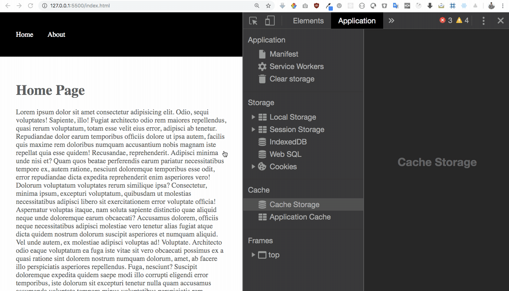
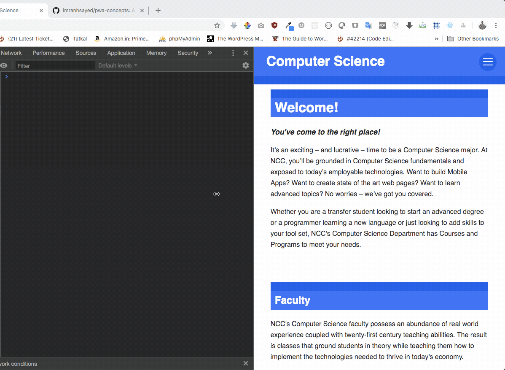
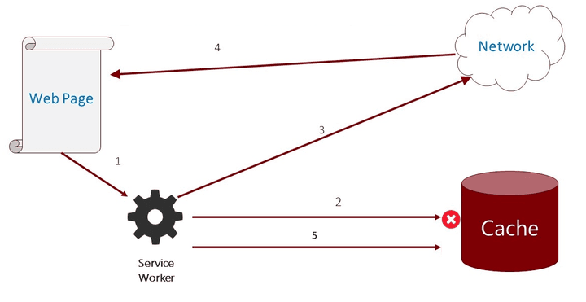
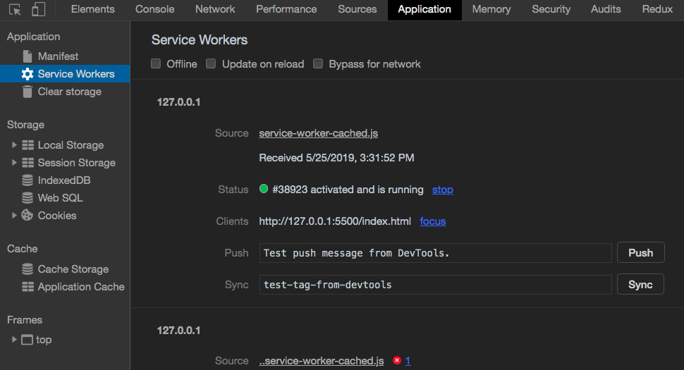
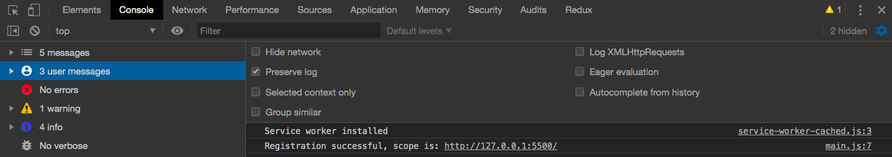
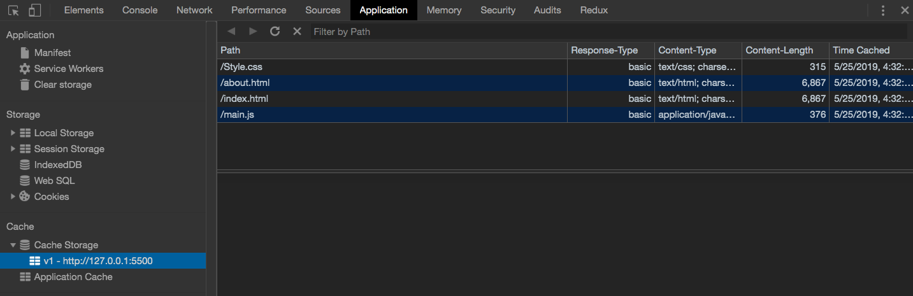
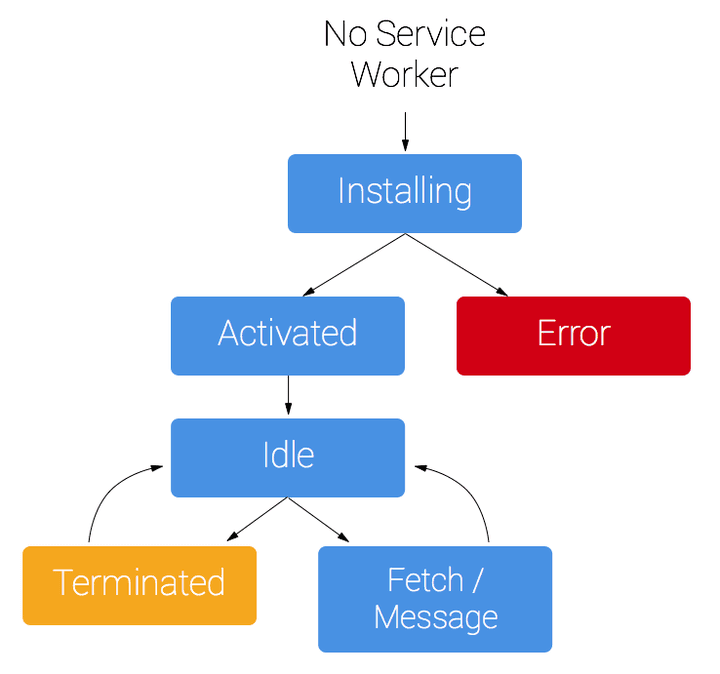
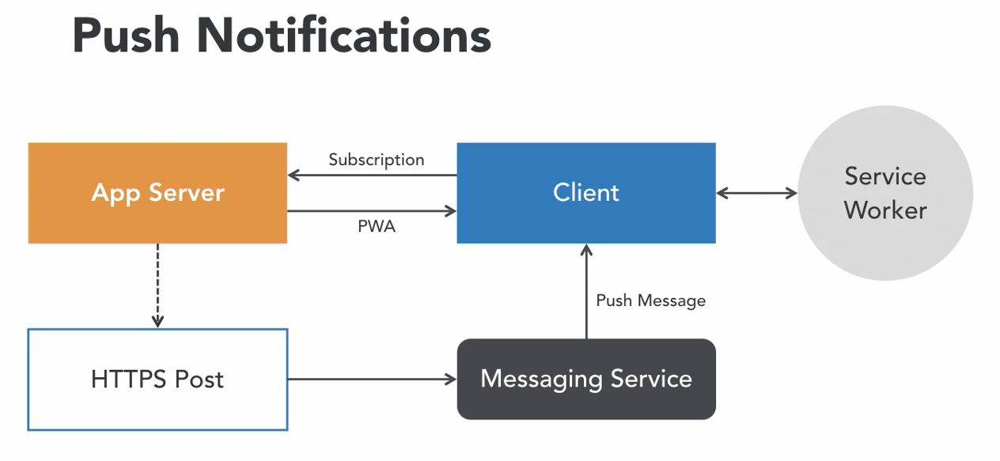

# PWA Concepts
> * A demo for PWA Concepts.

## Serve Pages Offline using Service Workers Demo :video_camera:



## [Sending Notifications in a PWA Demo](https://github.com/imranhsayed/pwa-concepts/tree/send-notification-user-nav) :video_camera:


## Getting Started :rocket:

These instructions will get you a copy of the project up and running on your local machine for development purposes.

### Prerequisites :page_facing_up:

Basic knowledge of HTML CSS and JavaScript.

## Service Workers :construction_worker:

### What are Service Workers?
A service worker is an event-driven javascript file, that is run in your browser in the background, separate from your webpage.

* act as a caching agent 
* handle network requests,
* store content for offline usage, using caching and 
* handle push messaging even when your browser is closed.

### How Service Workers work?
* It provides a persistence medium for you to keep network requests like other pages, images, scripts, CSS files, etc. in a controllable cache. 
* When a network request is made it passed through the service worker where you can decide if you will return the cached response or make the network round trip
* The Cache API provides the methods you can programmatically use to manage how network responses are cached.
* Responses are stored in the cache as a key value pair, where the key is the Request and the Response
* Using a fetch event handler you can intercept all the requests, interrogate the Request object and execute your caching strategy.

* So in below example, when any network request is made, we intercept that request,
we use using `cache.match()` to check if we get response from cache, if not make a fetch request to network ( `fetch(event.request)` ),
 put the new response in cache ( `cache.put()` ) and return the response. Check the demo picture.

```ruby
self.addEventListener("fetch", function(event) {
	event.respondWith(
		caches.open( cacheName )
			.then( cache => {

				return cache.match( event.request )
					.then(response => {

						// Check if you get response from cache, using cache.match(), if not make a fetch request to network , put the new response in cache and return the response
						return response || fetch(event.request)
									.then(function(response) {
										cache.put(event.request, response.clone());
										return response;
									});
					})
			} )
);
});
```



## Steps to Create a Progressive Web App:

1. We register a Service Worker ( in main.js )
2. Create a Service Worker file called `sw.js` and perform the below operations inside that.
3. Define `cacheName` and paths for the files to be cached inside `sw.js`
4. We listen to `install` event and `cache all files` we defined above, when the service worker is installed.
5. We listen to `activate` event and `delete the old version` of the cache, if there is a new version of cache available
6. We listen to the `fetch` event, the request is made on PWA, we `fetch the content from the cache` if its available otherwise we make a network request.
7. Add the icons for PWA
8. Add a `manifest.json` file and add the required fields and values
9. Add relevant `meta tags`, link your manifest.json file and include your main.js file, in `index.html`
10. Once done perform a `lighthouse audit` your site for PWA , under performance tab in chrome developer tool.


#### Registration


### Installation


### Cache Storage


## Service worker lifecycle
A service worker goes through three steps in its lifecycle:

1. Registration
2. Installation
3. Activation



### 1. Registration of Service Worker
To install a service worker, you need to register it in your main JavaScript code. Registration tells the browser where your service worker is located, and to start installing it in the background. Let's look at an example:

```ruby
if( 'serviceWorker' in navigator ) {
    navigator.serviceWorker
        .register( './service-worker-cached.js' )
        .then( registeration => console.log('Registration successful, scope is:', registeration.scope) )
        .catch( err => console.log('Service worker registration failed, error:', err) );
}
```

### 2. Installation of Service Worker
A service worker installation triggers an install event in the installing service worker. 

```ruby
// Listen for install event, set callback
self.addEventListener('install', ( event ) => {
    // Perform some task
});
```

### 2. Activation of Service Worker

```ruby
self.addEventListener( 'activate', ( event ) => {
    console.log( 'Service worker Activated' )
} );
```

## What is a [manifest file](https://developers.google.com/web/fundamentals/web-app-manifest/) for Web App?

* The web app manifest is a simple JSON file that tells the browser about your web application and how it should behave when 'installed' on the user's mobile device or desktop.
* Having a manifest is required by Chrome to show the Add to Home Screen prompt.
* A typical manifest file includes information about the app name, icons it should use, the start_url it should start at when launched, and more.

## How does push notification work?

> You need to ensure that you change the cache version name in sw.js file , every time you want to send a notification otherwise your pwa will pick up the data from cache and won’t have the new changes
  Notifications are shown from the service worker not the web app. The service worker goes on its own thread, independent of the app. So this is what allows it to display notifications, even when the app is not action.
  This means when we send notification, the serviceWorker does not have to be active, but just registered. So as soon as the serviceWorker gets registered we can send the notification.

```ruby
if ( 'serviceWorker' in navigator ) {

	navigator.serviceWorker.register( '/sw.js' )
		.then( ( res ) => {
			console.warn( `Sevice Worker Registered ${res.scope}` );

			// Check if notifications are supported
			if ( 'Notification' in window ) {
				console.warn( 'Notifications are supported' );

				// Request permission from user to send notifications.
				Notification.requestPermission().then( ( status ) => {
					
					if ( 'granted' === status ) {
						// When service worker is ready to show a notification, show the notification in the promise method
						navigator.serviceWorker.ready.then( ( registration ) =>  registration.showNotification( 'New Notification' ) );
					}
				} )
			}
		} )
		.catch( err => console.warn( 'SW registration failed' + err ) )
}
```

## Push Notification Data Flow

* Client access PWA > PWA persmission to send notification > Permission granted > Subsription object is created > Store the notification data in subscription
* HTTP Post request > to Messaging Service ( like firebase ) > Messing server sends push message to client > App is awakened > Push message is routed to the correct Service Worker
* User clicks on Notification > Code in the Notification Clicked event executes



## Installation :wrench:

1. Clone this repo by running `git clone git@github.com:imranhsayed/pwa-concepts.git`
2. `cd pwa-concepts`
3. Install `Live Server` plugin from VS Code

## Branches Information

1. [simple-progressive-web-app](https://github.com/imranhsayed/pwa-concepts/tree/simple-progressive-web-app) A Simple Progressive Web App
2. [pwa-with-custom-prompt](https://github.com/imranhsayed/pwa-concepts/tree/pwa-with-custom-prompt) A Simple Progressive Web App with custom Add To Home Screen Mobile Prompt.
3. [service-worker-app](https://github.com/imranhsayed/pwa-concepts/tree/service-worker-app) A simple Service worker app.

4. [pwa-app-http-server](https://github.com/imranhsayed/pwa-concepts/tree/pwa-app-http-server) A Progressive Web App5. [send-notification-user-nav](https://github.com/imranhsayed/pwa-concepts/tree/send-notification-user-nav) Example of sending Notification in a PWA app. And when the user clicks on the notification, we can navigate him the section of the page we want 
5. [send-notification-user-nav](https://github.com/imranhsayed/pwa-concepts/tree/send-notification-user-nav) Example of sending Notification in a PWA app. And when the user clicks on the notification, we can navigate him the section of the page we want 

##### Command
* `npm run start` Starts your development server on [http://localhost:8081](http://localhost:8081)
* `Cmd + Shift + P > Type Clear Console history` Shortcut to clear cache data.

## Useful Link :point_right:

1. [Genrate Favicon](https://realfavicongenerator.net)

## Training Links :mortar_board:

1. [Service Workers Documentation](https://developers.google.com/web/ilt/pwa/introduction-to-service-worker)
2. [Service Worker Strategy Cookbook](https://serviceworke.rs/)

## Contributing :busts_in_silhouette:

Please read [CONTRIBUTING.md](https://gist.github.com/PurpleBooth/b24679402957c63ec426) for details on our code of conduct, and the process for submitting pull requests to us.

## Versioning :bookmark_tabs:

I use [Git](https://github.com/) for versioning. 

## Author :bust_in_silhouette:

* **[Imran Sayed](https://codeytek.com)**

## License :page_with_curl:

This project is licensed under the MIT License - see the [LICENSE.md](LICENSE.md) file for details
